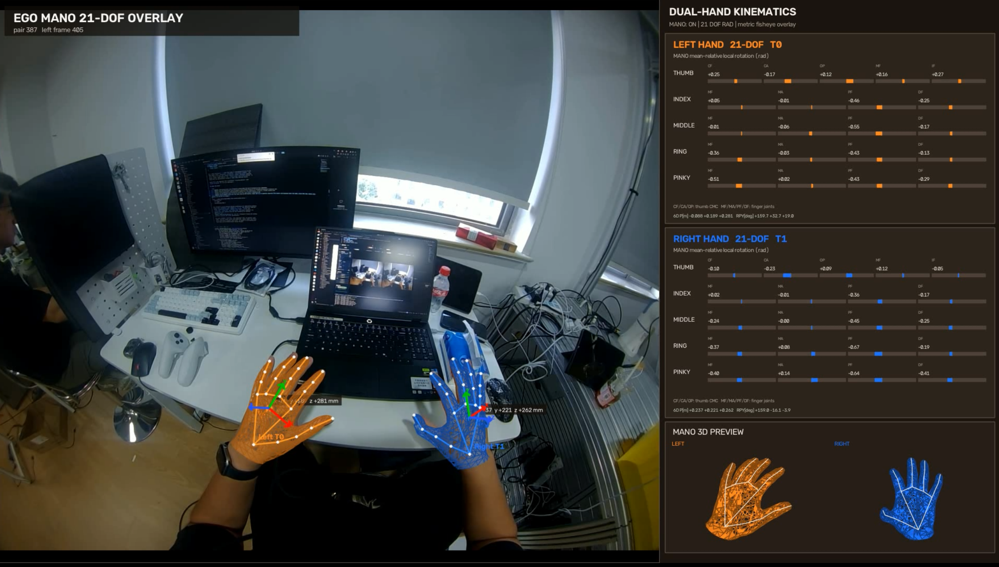

# EGO Hand System

面向头戴式双目相机的离线手部重建与 MANO 拟合系统。当前主要支持两种输入：

- `orbbec`：Orbbec EGO 左右视频、硬件时间戳、KB 鱼眼标定和可选 IMU；
- `gen`：GEN DAS EGO MCAP/H264、KB 或 Double Sphere 双目标定。

两类数据在双目校正后复用同一套处理链路：

```text
Orbbec session ───────────────────────┐
                                      ├─> 双目 MediaPipe ─> 3D 稳定化
GEN MCAP ─> 标准化 ─> 双目校正 ──────┘
   ─> 两阶段 MANO 拟合 ─> 原始画面网格叠加 ─> 21-DOF / 末端 6D CSV
```

## 效果展示



Orbbec EGO 离线处理结果：左侧在原始鱼眼画面上叠加双手 MANO 网格、骨架和
末端 6D 坐标轴；右侧同步显示左右手 21-DOF 数值及独立 MANO 3D 预览。

## 离线快速开始

### 1. 准备环境

```bash
conda env create -f environment.yml
conda activate ego-hand
unset PYTHONPATH
```

如果 `ego-hand` 环境是在 GEN 支持合入之前创建的，请同步新增的 MCAP/PyAV 依赖：

```bash
conda env update -n ego-hand -f environment.yml
```

确认下列资产已准备好：

```text
models/hand_landmarker.task
models/mano/MANO_LEFT.pkl
models/mano/MANO_RIGHT.pkl
third_party/MANO/mano/model.py
```

MANO 模型需要从官方渠道获取并接受许可，安装说明见
[models/README.md](models/README.md)。外部源码和本地资产也可分别使用：

```bash
./scripts/setup_third_party.sh
./scripts/install_local_assets.sh --archive /path/to/ego_hand_assets.tar.gz
```

### 2. 选择输入类型

变量需要使用 `export`，这样 `run_offline.sh` 才能读取到它们。

#### Orbbec EGO

```bash
export EGO_SOURCE=orbbec
export EGO_SESSION=recordings/Orbbec_Ego_AZER764008C_20260806_110653
export EGO_OUTPUT=output/recording_20260806_110653_run2
```

也可以从模板开始：

```bash
cp configs/offline_orbbec.env.example .env.offline
# 编辑 .env.offline
source .env.offline
```

Orbbec session 中应包含左右 MP4、左右硬件 PTS CSV 和相机标定 YAML。程序按硬件
时间戳配对，不能把两个视频的第 N 帧直接当作同一时刻。

#### GEN DAS EGO

```bash
export EGO_SOURCE=gen
export EGO_MCAP=/path/to/DAS-Ego_example.mcap
export EGO_OUTPUT=output/gen_das_example
export EGO_LEFT_CAMERA=camera2
export EGO_RIGHT_CAMERA=camera3
```

也可以使用模板：

```bash
cp configs/offline_gen.env.example .env.offline
# 编辑 MCAP 路径和输出目录
source .env.offline
```

GEN 默认使用头环中间双目 `camera2/camera3`。入口会先将 MCAP 解码为统一原始
数据集，再根据标定自动选择 KB 或 Double Sphere 模型生成针孔双目数据。

### 3. 检查配置并运行

先只检查路径、输入格式和模型资产。GEN 还会检查 MCAP/PyAV 依赖，并真实解码一帧：

```bash
./scripts/run_offline.sh check
```

检查通过后运行完整流程：

```bash
./scripts/run_offline.sh all
```

脚本会自动使用当前激活的 `ego-hand` 环境；未激活但系统存在 Conda 时，会使用
`conda run -n ego-hand`。MANO 默认 `EGO_DEVICE=auto`，CUDA 可用时自动使用 GPU。

## 分阶段运行与断点恢复

完整流程耗时较长，可以逐段执行：

| 阶段 | 命令 | 作用 |
|---|---|---|
| 配置检查 | `./scripts/run_offline.sh check` | 检查数据源、模型和 MANO 资产 |
| 输入准备 | `./scripts/run_offline.sh prepare` | Orbbec 会话预览；GEN 标准化与校正 |
| 双目重建 | `./scripts/run_offline.sh stereo` | MediaPipe、跨相机关联和 21 点三角化 |
| 3D 稳定 | `./scripts/run_offline.sh stabilize` | 离群管理、短缺口补全和骨长约束 |
| MANO 拟合 | `./scripts/run_offline.sh fit` | 稳定初值和低学习率精修两阶段拟合 |
| 最终导出 | `./scripts/run_offline.sh render` | 网格叠加、21-DOF 和手末端 6D CSV |
| 全部阶段 | `./scripts/run_offline.sh all` | 按顺序运行以上所有阶段 |

也可以通过环境变量选择阶段：

```bash
export EGO_STAGE=stereo
./scripts/run_offline.sh
```

每个阶段以 `summary.json` 或对应数据清单作为完成标志。再次运行时，已完成的阶段
会自动跳过；如果发现只有目录、没有完成标志，脚本会停止并提示使用新输出目录，
不会自动覆盖或删除可能有用的中间结果。

修改数据源、相机、`EGO_MAX_PAIRS` 或重要参数后，应使用新的 `EGO_OUTPUT`。

## 常用运行变量

| 变量 | 默认值 | 说明 |
|---|---|---|
| `EGO_SOURCE` | 必填 | `orbbec` 或 `gen` |
| `EGO_SESSION` | Orbbec 必填 | Orbbec session 目录 |
| `EGO_MCAP` | GEN 必填 | GEN `.mcap` 文件 |
| `EGO_OUTPUT` | 必填 | 本次实验的统一输出根目录 |
| `EGO_LEFT_CAMERA` | `camera2` | GEN 左相机 ID |
| `EGO_RIGHT_CAMERA` | `camera3` | GEN 右相机 ID |
| `EGO_DEVICE` | `auto` | `auto`、`cuda` 或 `cpu` |
| `EGO_MAX_PAIRS` | `0` | 下游最大双目帧对数，`0` 表示全部 |
| `EGO_MAX_FRAMES` | `0` | GEN 每路最大解码帧数，`0` 表示全部 |
| `EGO_NO_VIDEO` | `0` | 设为 `1` 时跳过诊断视频，保留 CSV/JSON/NPZ |
| `EGO_CONDA_ENV` | `ego-hand` | 自动使用的 Conda 环境名 |
| `EGO_PYTHON` | 未设置 | 指定 Python 路径并绕过 Conda 自动选择 |

第一次验证新数据时建议使用独立的冒烟测试输出目录：

```bash
export EGO_OUTPUT=output/my_recording_smoke
export EGO_MAX_PAIRS=60

# GEN 还可以限制 MCAP 解码量
export EGO_MAX_FRAMES=80

./scripts/run_offline.sh all
```

冒烟测试通过后，将限制恢复为 `0`，并换一个新的正式输出目录。

## 输出目录

Orbbec 和 GEN 的后半段输出结构一致；GEN 额外包含标准化和校正数据集：

```text
$EGO_OUTPUT/
  session_check/                         # 仅 Orbbec，可选会话预览
  normalized/                            # 仅 GEN，原始统一数据集
  rectified/                             # 仅 GEN，校正后的针孔双目数据集
  mediapipe_stereo/
    stereo_annotated.mp4
    stereo_frames.csv
    stereo_landmarks_3d.csv
    summary.json
  mano_preparation/
    mano_input.npz
    stabilized_landmarks_3d.csv
    summary.json
  mano_fit_optimized_initial_rigid/
    summary.json
    track_*.npz
  mano_fit_optimized_final/
    summary.json
    track_*.npz
  mano_overlay_optimized/
    mano_overlay_21dof.mp4
    mano_joint_angles_21dof.csv
    hand_end_effector_6d.csv
    summary.json
```

最先建议检查：

```bash
xdg-open "$EGO_OUTPUT/mediapipe_stereo/stereo_annotated.mp4"
xdg-open "$EGO_OUTPUT/mano_overlay_optimized/mano_overlay_21dof.mp4"
```

如果设置了 `EGO_NO_VIDEO=1`，请改看各阶段的 `summary.json` 和 CSV。

## 排错顺序

1. `check` 失败：先修正输入路径、Conda 环境或模型资产；
2. 双目视频中手身份跳变：检查 `mediapipe_stereo/stereo_annotated.mp4`，问题位于检测、左右关联或三角化；
3. 双目点稳定但网格不贴手：检查 `mano_fit_optimized_final/summary.json`；
4. GEN 无法解码：单独运行 `python scripts/check_gen_environment.py --mcap "$EGO_MCAP"`；
5. 某阶段留下不完整目录：保留它用于排错，并换一个新的 `EGO_OUTPUT` 重跑。

## 坐标与数据约定

- 三维坐标单位统一为米；
- `cam_0` 或所选左相机是参考相机，右相机是 `cam_1`；
- 双目 3D 和 MANO 初始输出位于原始左相机 OpenCV 光学坐标系；
- Orbbec KB 畸变使用 OpenCV `cv::fisheye`；
- GEN 支持 KB/Kannala–Brandt 和 Double Sphere；
- MediaPipe world landmarks 是手部模型相对坐标，不能代替双目相机坐标；
- 世界坐标仅由可选的 Basalt 阶段产生。

## 可选功能

### Orbbec 实时跟踪

实时模式不是当前离线主入口。需要 Orbbec SDK 本地运行时：

```bash
scripts/run_ego_live.sh
scripts/run_ego_live.sh --record
```

详见 [docs/EGO_REALTIME.md](docs/EGO_REALTIME.md)。

### Basalt 世界坐标轨迹

当前 Basalt 离线入口面向带 IMU 的 Orbbec session。完成离线渲染后运行：

```bash
python scripts/run_basalt_offline.py \
  --session "$EGO_SESSION" \
  --hand-pose-csv "$EGO_OUTPUT/mano_overlay_optimized/hand_end_effector_6d.csv" \
  --output-root "$EGO_OUTPUT/basalt_world"
```

详见 [docs/BASALT_STEREO_INERTIAL_WORLD_TRAJECTORY.md](docs/BASALT_STEREO_INERTIAL_WORLD_TRAJECTORY.md)。

## 构建与测试

C++ 会话检查和标定验证工具：

```bash
cmake -S . -B build -DCMAKE_BUILD_TYPE=Release
cmake --build build -j"$(nproc)"
ctest --test-dir build --output-on-failure
```

Python 回归测试：

```bash
conda run --no-capture-output -n ego-hand \
  python -m unittest discover -s tests -p 'test_*.py' -v
```

更多说明：

- [双目深度、畸变和坐标流程](docs/STEREO_DEPTH_AND_DISTORTION_PIPELINE.md)
- [MANO 运动稳定策略](docs/MANO_MOTION_STABILITY_OPTIMIZATION_20260804.md)
- [21-DOF 仪表板与角度定义](docs/mano_21dof_dashboard_20260804.md)
- [参考结果](docs/RESULTS.md)
- [仓库内容与本地资产边界](docs/REPOSITORY_CONTENTS.md)
